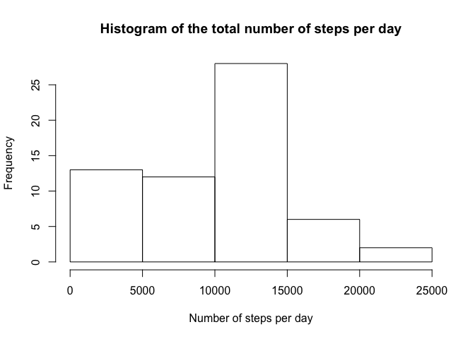
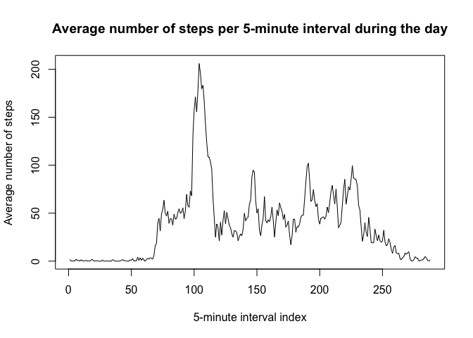
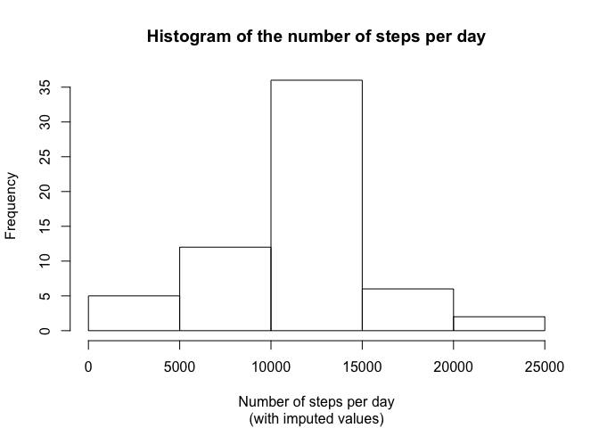
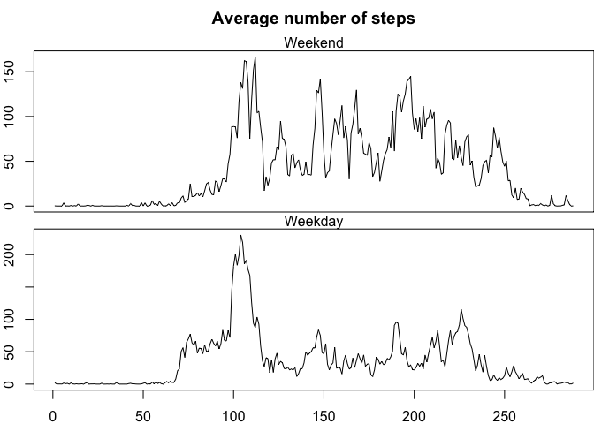

## Loading and preprocessing the data


```r
library(dplyr)
df <- read.csv("activity.csv")
```

## What is mean total number of steps taken per day?


```r
dailysteps <- summarise(group_by(df, date), sum(steps, na.rm = TRUE))
colnames(dailysteps) <- c('date', 'totalsteps')
hist(dailysteps$totalsteps, main = "Histogram of the total number of steps per day",
	 xlab = "Number of steps per day")
```

<!-- -->
Mean number of steps per day:

```r
print(mean(dailysteps$totalsteps, na.rm = TRUE))
```

```
## [1] 9354.23
```
Median number of steps per day:

```r
print(median(dailysteps$totalsteps, na.rm = TRUE))
```

```
## [1] 10395
```

## What is the average daily activity pattern?


```r
intervalsteps <- summarise(group_by(df, interval), mean(steps, na.rm = TRUE))
colnames(intervalsteps) <- c('interval', 'totalsteps')
plot(intervalsteps$totalsteps, type = "l",
	 main = "Average number of steps per 5-minute interval during the day",
	 xlab = "5-minute interval index", ylab = "Average number of steps")
```

<!-- -->

The interval with the maximum average number of steps:

```r
print(intervalsteps$interval[which.max(intervalsteps$totalsteps)])
```

```
## [1] 835
```

## Imputing missing values

Total number of rows with missing values:

```r
print(sum(!complete.cases(df)))
```

```
## [1] 2304
```

Strategy for missing values:
* Compute the mean value for the interval (ignoring NAs)
* Compute the mean value for the day (ignoring NAs)
* Impute the value by taking the mean of the above two averages (ignoring NAs)


```r
# Copy the data frame
dfimp <- df

# Compute the daily mean and the mean per interval, both ignoring NAs
dailymeansteps <- summarise(group_by(df, date), mean(steps, na.rm = TRUE))
colnames(dailymeansteps) <- c('date', 'meansteps')
intervalmeansteps <- summarise(group_by(df, interval), mean(steps, na.rm = TRUE))
colnames(intervalmeansteps) <- c('interval', 'meansteps')

# Impute the missing values using the strategy described above
for(i in 1:nrow(df)) {
	thisrecord <- df[i,]
	if(is.na(thisrecord$steps)) {
		intmean <- filter(intervalmeansteps, interval == thisrecord$interval)$meansteps
		daymean <- filter(dailymeansteps, date == thisrecord$date)$meansteps
		dfimp$steps[i] <- mean(c(intmean, daymean), na.rm = TRUE)
	}
}
```

Histogram of the total number of steps per day using the dataset with imputed values


```r
dailystepsimp <- summarise(group_by(dfimp, date), sum(steps, na.rm = TRUE))
colnames(dailystepsimp) <- c('date', 'totalsteps')
hist(dailystepsimp$totalsteps, main = "Histogram of the number of steps per day",
	 sub = "(with imputed values)", xlab = "Number of steps per day")
```

<!-- -->

Mean number of steps per day using the dataset with imputed values:

```r
dailystepsimp <- summarise(group_by(dfimp, date), sum(steps))
colnames(dailystepsimp) <- c('date', 'totalsteps')
print(mean(dailystepsimp$totalsteps))
```

```
## [1] 10766.19
```
Median number of steps per day using the dataset with imputed values:

```r
print(median(dailystepsimp$totalsteps))
```

```
## [1] 10766.19
```

Imputing values as implemented in this document leads to a larger fraction of values near the mean of the distribution. This has a modest impact on the median value, but the median changes significantly.

## Are there differences in activity patterns between weekdays and weekends?


```r
# Add the `daytype` data field to dfimp
weekday <- weekdays(as.Date(dfimp$date))
dfimp$daytype <- factor(ifelse(weekday == "Saturday" | weekday == "Sunday",
							   "weekend", "weekday"))

# Prepare plot
layout(matrix(1:2, ncol=1), widths=1, heights=c(2,2), respect=FALSE)
par(mar = c(0, 0, 1, 0), oma = c(2, 2, 2, 0))

# Weekend panel
wendsteps <- summarise(group_by(filter(dfimp, daytype == "weekend"), interval),
					   mean(steps))
colnames(wendsteps) <- c('interval', 'totalsteps')
plot(wendsteps$totalsteps, type = "l", xaxt = "n", ann = FALSE)
mtext("Weekend")

# Weekday panel
wdaysteps <- summarise(group_by(filter(dfimp, daytype == "weekday"), interval),
					   mean(steps))
colnames(wdaysteps) <- c("interval", "totalsteps")
plot(wdaysteps$totalsteps, type = "l", ann = FALSE)
mtext("Weekday")

# Add title and axis labels
title("Average number of steps", outer=TRUE)
mtext("5-minute interval index", 1, 3, outer=TRUE)
mtext("Average number of steps", 2, 3, outer=TRUE, las=0)
```

<!-- -->
